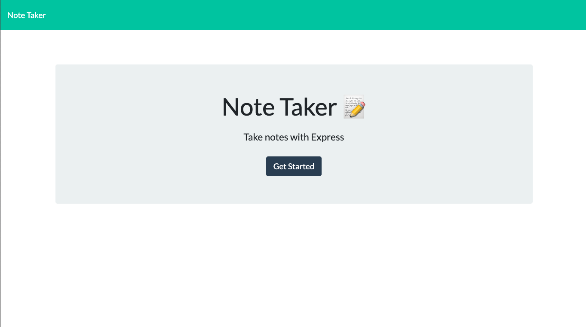

# Note Taker

  

  ## Table of Contents 
  
  * [Installation](#installation)
  * [Usage](#usage)
  * [License](#license)
  * [Contributing](#contributing)
  
  ## Installation
  
  To use this app, one may simply click the deployed link below to navigate to the site. Upon landing on the site, the user will see the following:
  
  

  https://git.heroku.com/evening-dusk-94636.git
  
  ## Usage 
  
  One may use this note-taking app for any number of reasons; however, it is probably best used for short, reminder-style notes. To use it, the user just types the title and joining message into the input fields provided and clicks the save icon in the top right corner. When and if the user would like to delete a note, they can click the appropriate "x" icon to the right of the desired note. 
  
  ## License
  
  This is project has an MIT license. 
  
  ## Contributing
  
  If you would like to contribute to this project please feel free to reach me by my email provided below. 
  
  ## Questions 
  
  Github username: jesscru
  
  Github repository page: github.com/jesscru

  If you have additonal questions or comments you can reach me at my email: jessicacrump7@gmail.com
